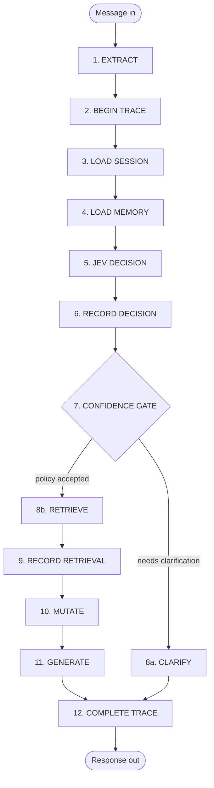
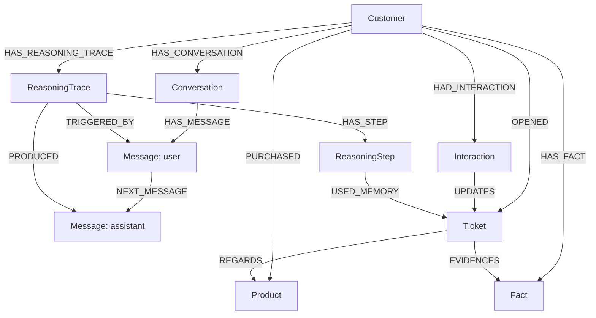

# Relay Memory

Relay is a customer-support agent that remembers returning customers. A normal
agent asks them to repeat the product and issue on every turn. Relay stores the
support history in Neo4j, retrieves the relevant context later, and updates the
right ticket.

## The Demo Story

Select **DEMO / Alex Morgan** in the UI, then send:

```text
My Relay Office Suite activation will not start. This is a new issue.
```

Jev chooses `NEW_ISSUE / CREATE / TROUBLESHOOT`, and Relay stores the ticket,
conversation, fact, and reasoning trace in Neo4j.

Then send a product-free follow-up:

```text
Activation still fails after reboot.
```

Relay retrieves the prior Office activation memory through Neo4j vector search
and graph traversal. Jev chooses `FOLLOW_UP / UPDATE`, so the agent updates the
existing ticket rather than asking which product the customer means.

The UI shows this proof in three places:

- **Memory Layers:** persisted conversation, fact, and Jev decision.
- **Decision Trace:** the selected policy, retrieved ticket count, and outcome.
- **Live Execution Trace:** vector recall, Jev decision, graph retrieval, mutation, and response.

## Run It

Copy `.env.example` to `.env`, then set Neo4j Aura values and `OPENROUTER_API_KEY`.

```sh
.venv/bin/python import_dataset.py
.venv/bin/python embed_memory.py
.venv/bin/python seed_demo.py
.venv/bin/python app.py
```

Open `http://127.0.0.1:8000`.

Useful checks:

```sh
.venv/bin/python -m unittest -v
.venv/bin/python test_classifier.py
```

## How It Works

Jev is the policy controller, not the prose generator. It converts each message
into a bounded decision. LangGraph executes that decision against Neo4j. A separate
OpenRouter chat model only turns the selected policy and retrieved context into a
customer-facing reply.

```mermaid
flowchart LR
	U[Customer message] --> P[Python + LangGraph]
	P --> E[Extract candidates\nspaCy + purchases]
	E --> M[Load Neo4j memory\nsession, graph, vectors]
	M --> J[Jev Decisions API]
	J --> D[Structured policy\nintent, product, issue\naction, response mode, next step]
	D --> G{Confidence gate}
	G -->|Low confidence or CLARIFY| C[Persist SupportSession\nask focused question]
	G -->|Policy accepted| R[Retrieve matching ticket\n+ semantic memory]
	R --> A[Execute ticket action\nCREATE / UPDATE / CLOSE / NONE]
	A --> L[OpenRouter chat model\nverbalizes selected policy]
	C --> N[(Neo4j Aura)]
	L --> N
	N --> T[Messages, facts, tickets\nreasoning traces, embeddings]
```



Jev returns these bounded fields on every turn:

| Field | Choices | Controls |
|---|---|---|
| `ticket_action` | `CREATE`, `UPDATE`, `CLOSE`, `NONE` | Ticket mutation in Neo4j |
| `response_mode` | `CLARIFY`, `TROUBLESHOOT`, `STATUS`, `ESCALATE` | Reply strategy |
| `next_step` | Approved support actions only | The one actionable recommendation |

## How a Message Executes

Every message runs through a 12-node LangGraph state machine. The graph is the
skeleton, Neo4j is the memory, Jev is the policy brain, and the prose LLM only
writes the final words. The LLM never decides what happens to the graph — Jev's
structured decision does.



| # | Node | What it does |
|---|---|---|
| 1 | `extract` | Runs spaCy candidate extraction, loads the customer's purchased products from the graph, and computes the `session_key` that scopes all memory to this person + conversation. |
| 2 | `begin_trace` | **Writes before it thinks.** Persists the user `Message` (with embedding), creates the `ReasoningTrace` (status `running`), and a first `ReasoningStep`. The turn is auditable even if the agent later fails. |
| 3 | `load_session` | Reads any pending `SupportSession` slots (`pending_intent`, `pending_product`, `pending_issue_type`) left over from a previous clarification. |
| 4 | `load_memory` | Loads all four memory layers: last 6 messages (short-term), up to 6 `Fact` nodes (long-term), last 4 prior Jev decisions (reasoning), and vector recall — top-4 similar `Message` + `Fact` embeddings (semantic). |
| 5 | `classify` | Calls Jev's Decisions API with 7 structured questions (intent, product, issue, ticket action, response mode, next step, is_resolved), each returning a choice + confidence. Then deterministic post-processing: merges confirmed session slots, applies semantic corroboration (a semantic match ≥ 0.5 naming the same product lifts low product confidence to the threshold), and computes `needs_clarification`. |
| 6 | `record_decision` | Persists the full Jev decision as a `ReasoningStep` with every confidence score, the threshold, and the reason. Links it to the classified `Product`. |
| 7 | Confidence gate | `needs_clarification` is true when `response_mode = CLARIFY`, or intent confidence < 0.85, or (intent is `NEW_ISSUE`/`ESCALATION` and product or issue confidence < 0.85). Action confidence is deliberately **not** a blocker. |
| 8a | `clarify` | MERGEs a `SupportSession` storing only the high-confidence slots, sets `last_question`, and returns the clarification question. The turn ends; the next message picks the confirmed slots back up in step 3. |
| 8b | `retrieve` | Only for `UPDATE`/`CLOSE`. Finds the customer's open tickets matching the product, with their interaction history. |
| 9 | `record_retrieval` | Persists a `retrieve_ticket_memory` step linked (`USED_MEMORY`) to the tickets used. |
| 10 | `mutate` | The only place business data changes, driven entirely by `ticket_action`: `CREATE` → new open `Ticket` + `REGARDS` product link; `UPDATE` → new `Interaction` on the existing ticket; `CLOSE` → new `Interaction` + ticket status `Closed`; `NONE` → no ticket change. Always records an `Interaction` and clears the `SupportSession`. |
| 11 | `generate` | Builds one prompt from all loaded context (products, short-term, long-term, reasoning, semantic, retrieved tickets, and the authoritative Jev policy) and calls the prose LLM (`gpt-4o-mini`, temperature 0.3). The prompt states the structured policy is authoritative — the LLM only writes words. |
| 12 | `complete_trace` | Persists the assistant `Message` (with embedding), commits a `Fact` when a ticket + issue type exist, adds a final `complete_turn` step, and marks the trace `complete`. |

The three memory layers in one line each:

- **Short-term** — the `Conversation`/`Message` chain: what was just said.
- **Long-term** — `Fact` nodes: durable "customer reported X on product Y".
- **Reasoning** — `ReasoningTrace`/`ReasoningStep`: the full audit log of every Jev decision.

## What Neo4j Remembers



- **Short-term:** `Conversation` and ordered `Message` nodes for the active session.
- **Long-term:** customers, purchased products, tickets, interactions, and durable `Fact` nodes.
- **Reasoning:** Jev decisions, confidence scores, retrieved tickets, and outcomes in `ReasoningTrace` steps.
- **Semantic:** embeddings on `Message` and `Fact` nodes, retrieved through Neo4j vector indexes.

The importer loads 8,469 support tickets, 8,320 customers, and 42 products. Jev can
only select a product owned by the current customer. If required context is genuinely
missing, the confidence gate persists a `SupportSession` and asks one focused question
instead of mutating a ticket.
