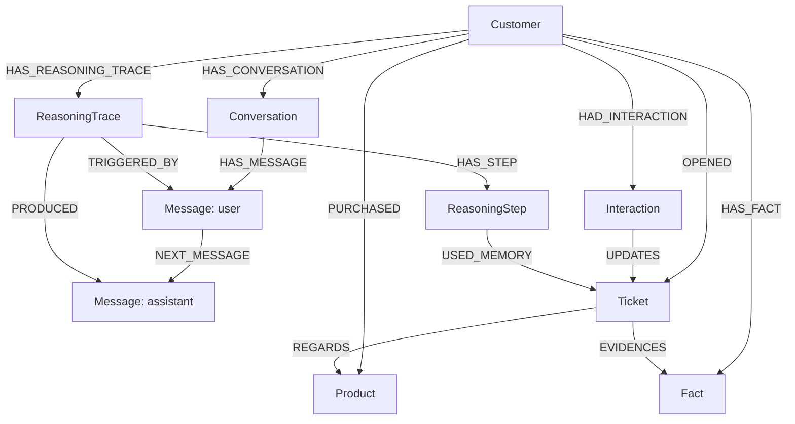

# Relay Memory

Relay is a customer-support agent that remembers returning customers. A normal
agent asks them to repeat the product and issue on every turn. Relay stores the
support history in Neo4j, retrieves the relevant context later, and updates the
right ticket.

## The Demo Story

Select **DEMO / Alex Morgan** in the UI, then send:

```text
My Relay Office Suite activation will not start. This is a new issue.
```

Jev chooses `NEW_ISSUE / CREATE / TROUBLESHOOT`, and Relay stores the ticket,
conversation, fact, and reasoning trace in Neo4j.

Then send a product-free follow-up:

```text
Activation still fails after reboot.
```

Relay retrieves the prior Office activation memory through Neo4j vector search
and graph traversal. Jev chooses `FOLLOW_UP / UPDATE`, so the agent updates the
existing ticket rather than asking which product the customer means.

The UI shows this proof in three places:

- **Memory Layers:** persisted conversation, fact, and Jev decision.
- **Decision Trace:** the selected policy, retrieved ticket count, and outcome.
- **Live Execution Trace:** vector recall, Jev decision, graph retrieval, mutation, and response.

## Run It

Copy `.env.example` to `.env`, then set Neo4j Aura values and `OPENROUTER_API_KEY`.

```sh
.venv/bin/python import_dataset.py
.venv/bin/python embed_memory.py
.venv/bin/python seed_demo.py
.venv/bin/python app.py
```

Open `http://127.0.0.1:8000`.

Useful checks:

```sh
.venv/bin/python -m unittest -v
.venv/bin/python test_classifier.py
```

## How It Works

Jev is the policy controller, not the prose generator. It converts each message
into a bounded decision. LangGraph executes that decision against Neo4j. A separate
OpenRouter chat model only turns the selected policy and retrieved context into a
customer-facing reply.

```mermaid
flowchart LR
	U[Customer message] --> P[Python + LangGraph]
	P --> E[Extract candidates\nspaCy + purchases]
	E --> M[Load Neo4j memory\nsession, graph, vectors]
	M --> J[Jev Decisions API]
	J --> D[Structured policy\nintent, product, issue\naction, response mode, next step]
	D --> G{Confidence gate}
	G -->|Low confidence or CLARIFY| C[Persist SupportSession\nask focused question]
	G -->|Policy accepted| R[Retrieve matching ticket\n+ semantic memory]
	R --> A[Execute ticket action\nCREATE / UPDATE / CLOSE / NONE]
	A --> L[OpenRouter chat model\nverbalizes selected policy]
	C --> N[(Neo4j Aura)]
	L --> N
	N --> T[Messages, facts, tickets\nreasoning traces, embeddings]
```



Jev returns these bounded fields on every turn:

| Field | Choices | Controls |
|---|---|---|
| `ticket_action` | `CREATE`, `UPDATE`, `CLOSE`, `NONE` | Ticket mutation in Neo4j |
| `response_mode` | `CLARIFY`, `TROUBLESHOOT`, `STATUS`, `ESCALATE` | Reply strategy |
| `next_step` | Approved support actions only | The one actionable recommendation |

## What Neo4j Remembers



- **Short-term:** `Conversation` and ordered `Message` nodes for the active session.
- **Long-term:** customers, purchased products, tickets, interactions, and durable `Fact` nodes.
- **Reasoning:** Jev decisions, confidence scores, retrieved tickets, and outcomes in `ReasoningTrace` steps.
- **Semantic:** embeddings on `Message` and `Fact` nodes, retrieved through Neo4j vector indexes.

The importer loads 8,469 support tickets, 8,320 customers, and 42 products. Jev can
only select a product owned by the current customer. If required context is genuinely
missing, the confidence gate persists a `SupportSession` and asks one focused question
instead of mutating a ticket.
