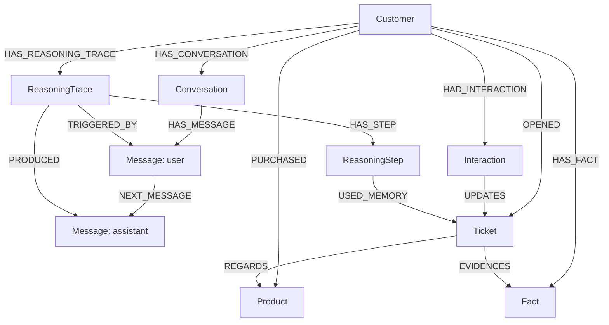

# Graph-memory support agent

Copy `.env.example` values into the ignored `.env` file and set `OPENROUTER_API_KEY`.
Both the classifier and the reply generator route through OpenRouter with that key:
`JEV_MODEL` (default `typesafe/jev-1.13`) makes the structured decision, `CHAT_MODEL`
(default `openai/gpt-4o-mini`) generates the customer-facing reply — Jev's endpoint
only outputs structured decisions, not free text, so a separate chat model still
drafts the reply from Jev's decision plus graph context.

```sh
.venv/bin/python import_dataset.py
.venv/bin/python embed_memory.py
.venv/bin/python test_classifier.py
.venv/bin/python -m unittest -v
.venv/bin/python seed_demo.py
.venv/bin/python agent.py
.venv/bin/python app.py
```

Open `http://127.0.0.1:8000` for the demo UI. It runs the same LangGraph agent
as the CLI and shows its persisted Neo4j tickets, interactions, and clarification session.

## Architecture

Jev is the policy controller, not the prose generator. It converts each message
into a bounded decision; LangGraph executes that decision against Neo4j; the chat
model only turns the selected policy and retrieved context into a customer-facing reply.



```mermaid
flowchart LR
	U[Customer message] --> P[Python + LangGraph]
	P --> E[Extract candidates\nspaCy + purchases]
	E --> M[Load Neo4j memory\nsession, graph, vectors]
	M --> J[Jev Decisions API]
	J --> D[Structured policy\nintent, product, issue\naction, response mode, next step]
	D --> G{Confidence gate}
	G -->|Low confidence or CLARIFY| C[Persist SupportSession\nask focused question]
	G -->|Policy accepted| R[Retrieve matching ticket\n+ semantic memory]
	R --> A[Execute ticket action\nCREATE / UPDATE / CLOSE / NONE]
	A --> L[OpenRouter chat model\nverbalizes selected policy]
	C --> N[(Neo4j Aura)]
	L --> N
	N --> T[Messages, facts, tickets\nreasoning traces, embeddings]
```

Jev returns these bounded fields on every turn:

| Field | Choices | Controls |
|---|---|---|
| `ticket_action` | `CREATE`, `UPDATE`, `CLOSE`, `NONE` | Ticket mutation in Neo4j |
| `response_mode` | `CLARIFY`, `TROUBLESHOOT`, `STATUS`, `ESCALATE` | Reply strategy |
| `next_step` | Approved support actions only | The one actionable recommendation |

## Memory Graph



- **Short-term memory:** ordered `Conversation` and `Message` nodes per session.
- **Long-term memory:** customer/product/ticket graph plus durable `Fact` nodes.
- **Reasoning memory:** Jev decision, confidence scores, retrieved tickets, and outcome in `ReasoningTrace` steps.
- **Semantic recall:** OpenRouter embeddings on `Message` and `Fact` nodes are retrieved through Neo4j vector indexes.

The importer is idempotent and adds the 8,469 ticket rows as `Customer`, `Product`,
`Ticket`, and `Interaction` nodes using the plan's relationships. The source has
139 repeat customers, three real statuses, and 42 products. Its descriptions are
synthetic/noisy, so the agent uses ticket subjects for memory summaries and does not
send raw descriptions to the response model.

Jev scores the message against controlled intent, product, issue, ticket action,
response mode, and next-step labels. It can only choose a product recorded in the
customer graph. The confidence gate routes uncertain decisions to a persisted
`SupportSession`; otherwise, the selected policy drives ticket mutation and response
generation. Product-free follow-ups can use semantic retrieval of earlier `Message`
and `Fact` embeddings to corroborate a Jev-selected product before asking the customer
to repeat information. Pass an optional second argument to `agent.py` to isolate
concurrent sessions for the same customer: `python agent.py <customer-id> <session-id>`.

The LangGraph routing, confidence gate, and mutation behavior are covered by offline
unit tests (`test_agent.py`, mocking the Jev call). `test_classifier.py` is a live
smoke test against the real Jev endpoint and requires imported data plus a working
`OPENROUTER_API_KEY`.
